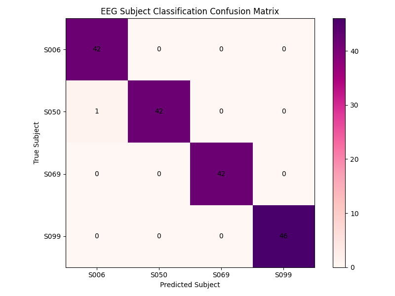

# EEG Biometric Authentication System

A machine learning based EEG biometric authentication and neural identity recognition system developed using real EEG recordings from the PhysioNet EEG Motor Movement/Imagery Dataset.

This project identifies individuals based on their EEG brainwave patterns using signal processing, feature extraction, dimensionality reduction, and SVM classification techniques.

The system also includes an interactive terminal-based neural profile access simulation with a cyberpunk-inspired UI.

---

# Features

- EEG preprocessing using MNE
- EDF file loading and analysis
- EEG bandpower feature extraction
- Channel-wise neural signal analysis
- Temporal windowing for increased sample generation
- PCA dimensionality reduction
- SVM-based biometric classification
- Majority voting prediction system
- Neural confidence scoring
- Confusion matrix visualization
- Interactive profile access system
- Aesthetic terminal UI using Rich

---

# Technologies Used

- Python
- NumPy
- Pandas
- Scikit-learn
- SciPy
- MNE
- Matplotlib
- Rich

---

# Project Structure

```text
eeg_auth/
│
├── config/
│   └── user_profiles.json
│
├── data/
│   ├── raw/
│   └── processed/
│
├── models/
│   ├── svm_model.pkl
│   ├── scaler.pkl
│   └── pca.pkl
│
├── results/
│   └── confusion_matrix.png
│
├── src/
│   ├── preprocess.py
│   ├── feature_extraction.py
│   ├── train_model.py
│   └── predict.py
│
├── main.py
├── requirements.txt
└── README.md
````

---

# Dataset

This project uses EEG recordings from:

PhysioNet EEG Motor Movement/Imagery Dataset

Each subject contains multiple EDF recordings that are used for training and prediction.

---

# Machine Learning Pipeline

## 1. EEG Preprocessing

EDF files are loaded using MNE and EEG recordings are extracted.

## 2. Feature Extraction

For every EEG channel:

* Delta band power (0.5–4 Hz)
* Theta band power (4–8 Hz)
* Alpha band power (8–13 Hz)
* Beta band power (13–30 Hz)

are extracted using Welch Power Spectral Density estimation.

## 3. Windowing

Each EEG recording is divided into 5-second windows.

This dramatically increases the number of training samples and improves biometric classification performance.

## 4. Dimensionality Reduction

PCA (Principal Component Analysis) reduces feature dimensionality while preserving important neural patterns.

## 5. Classification

An SVM classifier with RBF kernel is trained on extracted EEG features.

## 6. Prediction

The system predicts identity using:

* EEG feature extraction
* PCA transformation
* Majority voting across all EEG windows

---

# Accuracy

Current model accuracy:

```text
99.42%
```

Example confusion matrix:



---

# Running the Project

## Install dependencies

```bash
pip install -r requirements.txt
```

## Run the complete system

```bash
python main.py
```

---

# Interactive Neural Profile System

After successful EEG identification, the system allows access to simulated neural profile information including:

* Address
* Phone number
* Education
* Social media
* Email
* Physical features

All profile information is fictional and used only for demonstration purposes.

---

# Example Terminal Flow

```text
EEG BIOMETRIC AUTHENTICATION SYSTEM

→ Processing EEG recordings
→ Extracting neural features
→ Running biometric identification

IDENTITY VERIFIED

Authenticated User: Joker
Predicted Subject: S069

Confidence Scores:
S069 → 91.2%
S050 → 4.3%
S099 → 2.1%
S006 → 1.4%
```

---

# Future Improvements

* Deep learning based EEG classification
* Real-time EEG streaming
* Graphical desktop interface
* Authentication database integration
* Advanced neural feature extraction
* Real-world biometric deployment

---

# Disclaimer

This project is developed for educational and research purposes only.

All user profiles and identity information included in the project are fictional.